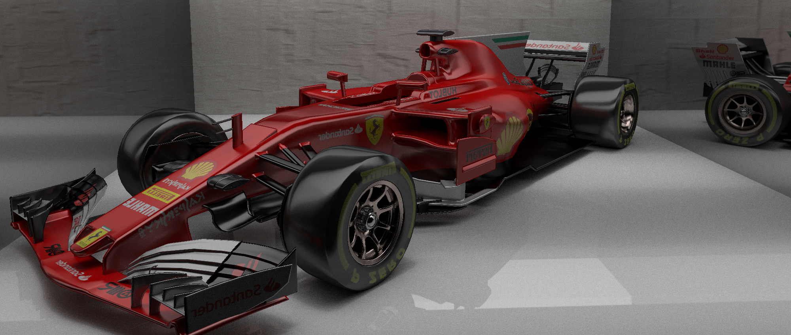
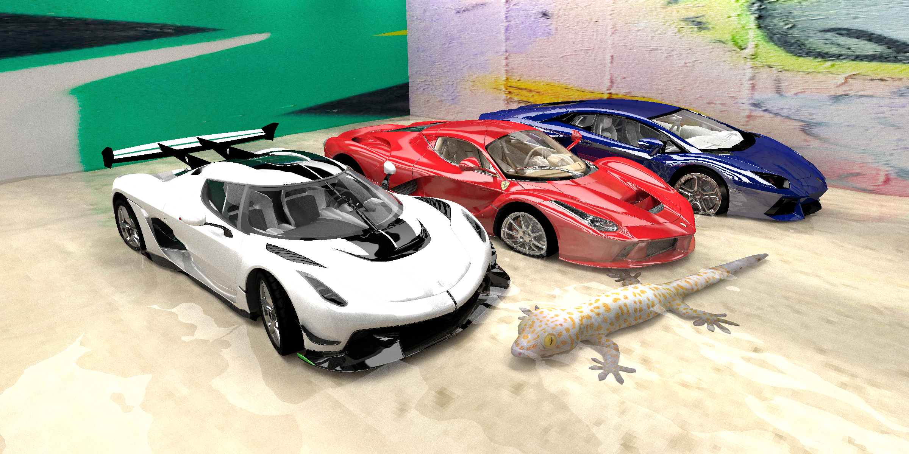

# GPU Pathtracer

## Credits

* LaFerrari model was by [mfaprodesign](https://free3d.com/user/mfaprodesign).
* The Lamborghini Aventador and Bumble Bee models were by [ysup12](https://free3d.com/user/ysup12).
* The Koenigsegg Jesco model was by [Steven Grey](https://sketchfab.com/Steven007).
* The Ferrari SF70H model was by [Dil Afroze Ahmed](https://free3d.com/user/dil_afroze).
* The gecko model was by [DigitalLife3D](https://sketchfab.com/DigitalLife3D).
* The mechanical shark and the ship in a bottle were by [Loïc Norgeot](https://sketchfab.com/norgeotloic).
* Glass 1 was by [Pedro Caio](https://free3d.com/user/pedrocaio442).
* Glass 2 was by [pledg](https://www.cgtrader.com/pledg).
* The doughnut was by [Mada Syauqy](https://free3d.com/user/masmada).
* The vase of flower was by [IvanMasanin](https://www.turbosquid.com/Search/Artists/IvanMasanin).
* The apple was by [Giiman](https://www.turbosquid.com/Search/Artists/Giimann).
* The plate was by [Grinya Lesnoy](https://free3d.com/user/lesovic).
* The minion was by [samaned](https://sketchfab.com/samaned).

## References

* https://github.com/RayTracing/raytracing.github.io
* https://github.com/rogerallen/raytracinginoneweekendincuda
* https://www.scratchapixel.com/
* https://www.pbrt.org/
* S. Woop, C. Benthin, and I. Wald, "Watertight Ray/Triangle Intersection," *Journal of Computer Graphics Techniques*, vol. 2, no. 1, 2013.
* T. Karras, "Maximizing Parallelism in the Construction of BVHs, Octrees, and *k*-d Trees," *High Performance Graphics*, 2012.
* Y. Li, "Nested Dielectrics", 2019 (https://blog.yiningkarlli.com/2019/05/nested-dielectrics.html).
* C. Schmidt and B. Budge, "Simple Nested Dielectrics in Ray Traced Images," *Journal of Graphics Tools*, 2002.
* E. Lengyel, "Chapter 7: Shading", *Foundations of Game Engine Development, Vol. 2*, 2019.
