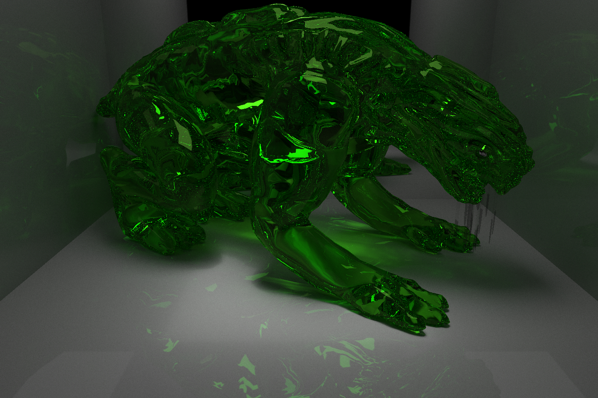
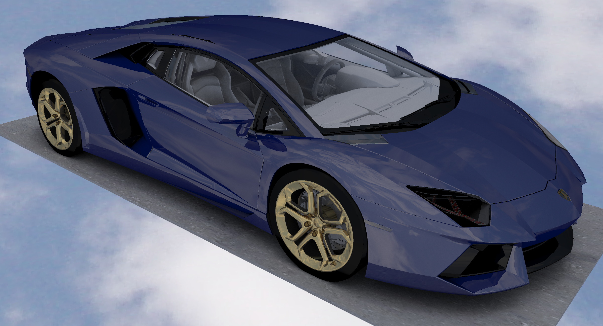

# GPU Pathtracer

## Credits

* LaFerrari model was by [mfaprodesign](https://free3d.com/user/mfaprodesign).
* Alien model was by [3dhaupt](https://free3d.com/user/3dhaupt).
* The Lamborghini Aventador and Bumble Bee models were by [ysup12](https://free3d.com/user/ysup12).
* The Ferrari SF70H model was by [Dil Afroze Ahmed](https://free3d.com/user/dil_afroze).

## References

* https://github.com/RayTracing/raytracing.github.io
* https://github.com/rogerallen/raytracinginoneweekendincuda
* https://www.scratchapixel.com/
* https://www.pbrt.org/
* S. Woop, C. Benthin, and I. Wald, "Watertight Ray/Triangle Intersection," *Journal of Computer Graphics Techniques*, vol. 2, no. 1, 2013.
* T. Karras, "Maximizing Parallelism in the Construction of BVHs, Octrees, and *k*-d Trees," *High Performance Graphics*, 2012.
