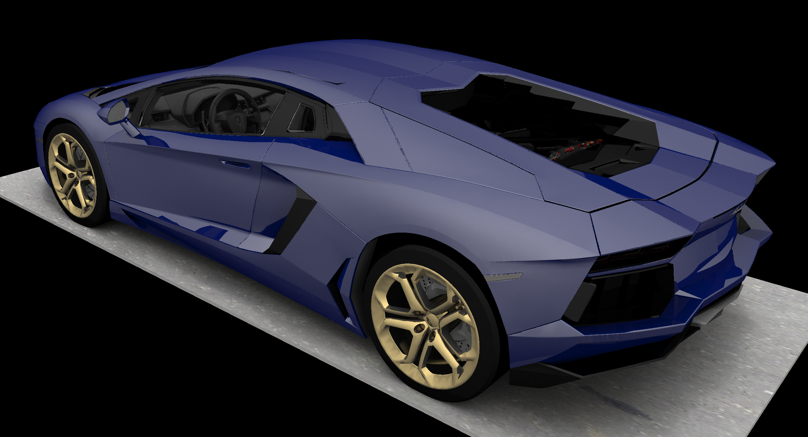
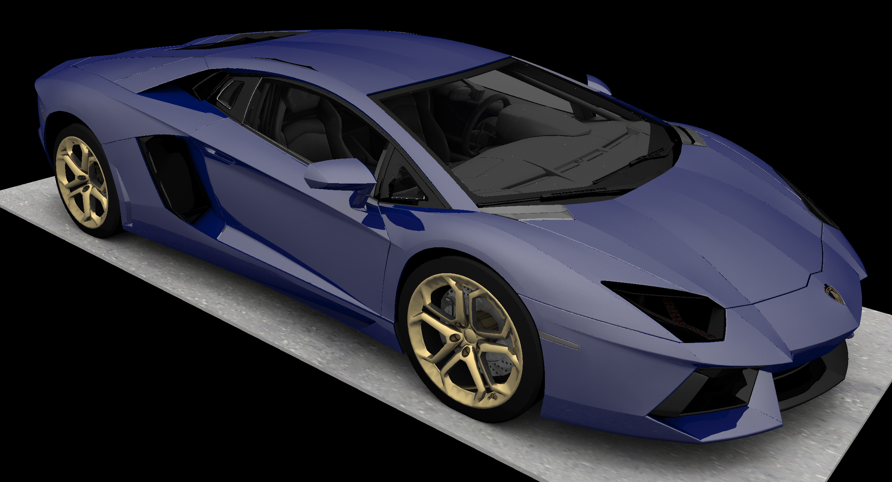
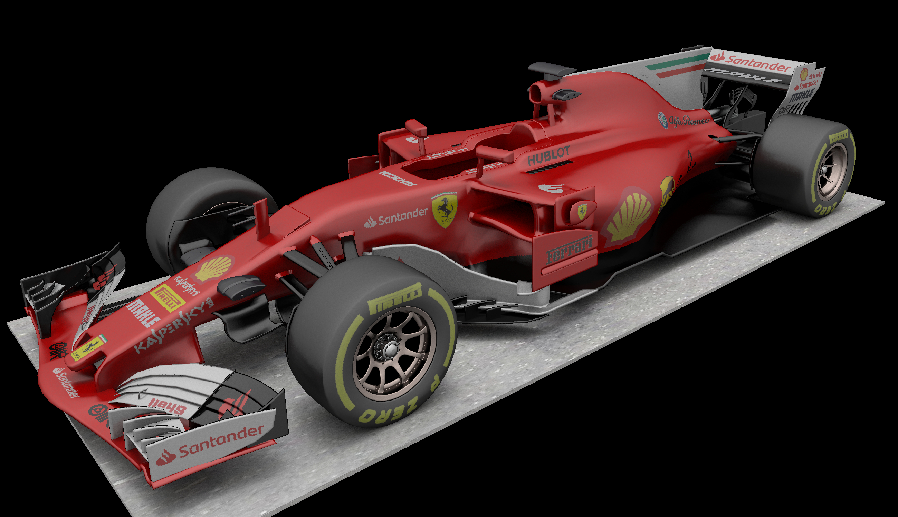
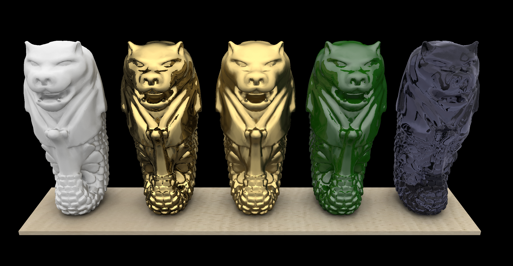

# GPU Pathtracer

## Credits

* The Lamborghini Aventador and Bumble Bee models were by [ysup12](https://free3d.com/user/ysup12).
* The Ferrari SF70H model was by [Dil Afroze Ahmed](https://free3d.com/user/dil_afroze).
* The Merlion model was by [sanjus](https://sketchfab.com/sanjus).

## References

* https://github.com/RayTracing/raytracing.github.io
* https://github.com/rogerallen/raytracinginoneweekendincuda
* https://www.scratchapixel.com/
