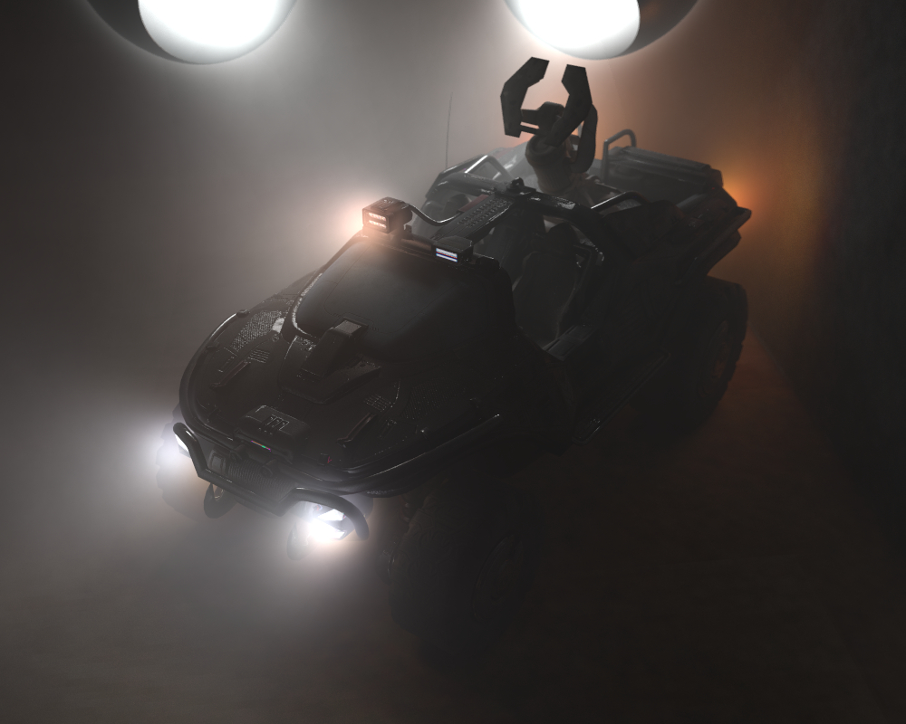

# GPU Renderer

## Features
* Path tracing
* Stochastic progressive photon mapping
* Participating medium
* OBJ file reader
* Bounding volume hierarchy acceleration structure
* Diffuse, metal, and dieletric materials
* Colour (texture) and normal mappings
* Camera depth of field
* Nested dielectrics
* Sub-surface scattering
* Importance sampling

## References

* https://github.com/RayTracing/raytracing.github.io
* https://github.com/rogerallen/raytracinginoneweekendincuda
* https://www.scratchapixel.com/
* https://www.pbrt.org/
* S. Woop, C. Benthin, and I. Wald, "Watertight Ray/Triangle Intersection," *Journal of Computer Graphics Techniques*, vol. 2, no. 1, 2013.
* T. Karras, "Maximizing Parallelism in the Construction of BVHs, Octrees, and *k*-d Trees," *High Performance Graphics*, 2012.
* Y. Li, "Nested Dielectrics", 2019 (https://blog.yiningkarlli.com/2019/05/nested-dielectrics.html).
* C. Schmidt and B. Budge, "Simple Nested Dielectrics in Ray Traced Images," *Journal of Graphics Tools*, 2002.
* E. Lengyel, "Chapter 7: Shading," *Foundations of Game Engine Development, Vol. 2*, 2019.
* A. C. Estevez and C. Kulla, "Importance Sampling of Many Lights with Adaptive Tree Splitting," *Proc. ACM Comput.Graph. Interact. Tech.*, 2018.
* E. P. Lafortune and Y. D. Willems, "Using the Modified Phong Reflectance Model for Physically Based Rendering," *Report CW 197*, 1994.
* T. Hachisuka, S. Ogaki, and H. W. Jensen, "Progressive Photon Mapping," *ACM Transactions on Graphics*, 2008.
* T. Hachisuka and H. W. Jensen, "Stochastic Progressive Photon Mapping," *ACM Transactions on Graphics*, 2009.
* C. Knaus and M. Zwicker, "Progressive Photon Mapping: A Probabilistic Approach," *ACM Transactions on Graphics*, 2011.
* R. Perrot, *et al.*, "Photon Mapping with Visible Kernel Domains," *Visual Computer*, 2019.
* W. Jarosz, M. Zwicker, and H. W. Jensen, "The Beam Radiance Estimate for Volumetric Photon Mapping," *Eurographics*, 2008.
* C. Collin, *et al.*, "Visibility-Driven Progressive Volume Photon Tracing," *Visual Computer*, 2013.

## Credits

* The Warthog model was by [McCarthy3D](https://sketchfab.com/joshuawatt811).
* The table lamp was from https://www.lugher3d.com/free-3d-models/table-lamp-fendi.
* The Douglas A-4 Skyhawk model was from https://done3d.com/douglas-a-4-skyhawk/.
* The Dr.Booms Exo model was by [LDsanya](https://www.blendswap.com/profile/740888).
* The leaf neon light was by [colinquinn](https://free3d.com/user/colinquinn).
* The neon sign was by [Alexander](https://www.cgtrader.com/alexbes).
* The T-Rex model was by [joel3d](https://www.turbosquid.com/Search/Artists/joel3d).
* The Indominus Rex model was by [AzurPoly](https://sketchfab.com/VapTor).
* LaFerrari model was by [mfaprodesign](https://free3d.com/user/mfaprodesign).
* The Lamborghini Aventador model was by [ysup12](https://free3d.com/user/ysup12).
* The Koenigsegg Jesco model was by [Steven Grey](https://sketchfab.com/Steven007).
* The gecko model was by [DigitalLife3D](https://sketchfab.com/DigitalLife3D).
* The mechanical shark and the ship in a bottle were by [Loïc Norgeot](https://sketchfab.com/norgeotloic).
* Glass 1 was by [Pedro Caio](https://free3d.com/user/pedrocaio442).
* Glass 2 was by [pledg](https://www.cgtrader.com/pledg).
* The doughnut was by [Mada Syauqy](https://free3d.com/user/masmada).
* The vase of flower was by [IvanMasanin](https://www.turbosquid.com/Search/Artists/IvanMasanin).
* The apple was by [Giiman](https://www.turbosquid.com/Search/Artists/Giimann).
* The plate was by [Grinya Lesnoy](https://free3d.com/user/lesovic).
* The minion was by [samaned](https://sketchfab.com/samaned).
